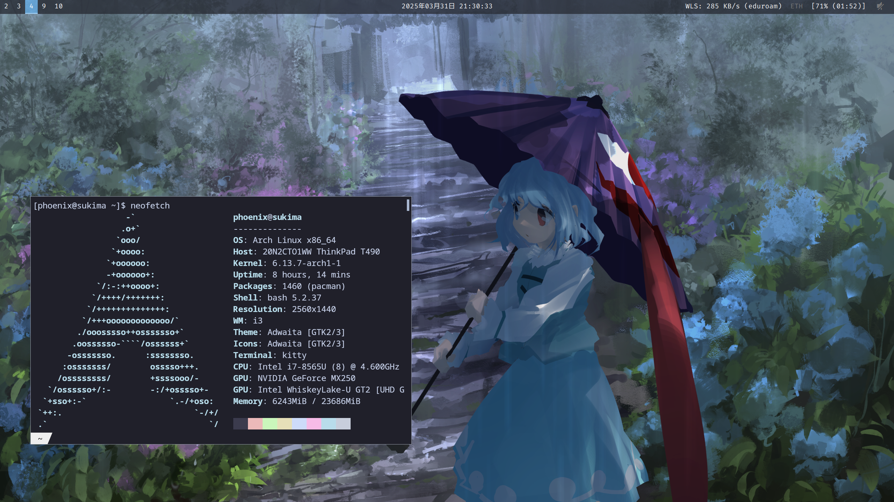

<h2></h2> 

    <b>h1divp's Linux configuration files</b>

<h2></h2> 

    

### hi there

I've been using arch linux for the past few years. I used to spend a lot of time configuring, but I feel like I'm now at a point where I don't worry about it much anymore, and pretty much
everything I need is set up.

If you see something you like, feel free to use it in your own config.

### Vital programs
* window manager: i3
* bar: polybar
* desktop manager: ly

### Some favorite apps
* top program: [bpytop](https://github.com/aristocratos/bpytop)
* file browser: [ranger](https://wiki.archlinux.org/title/Ranger)
* web browser: firefox
    * An underrated thing about firefox is that you can setup different profiles for work/leisure/study. I use this feature a lot.
* text editor: [helix](https://github.com/helix-editor/helix) (I used to use neovim a lot, but I switched since I don't have to worry about configuration as much)
* other utilities I couldn't live without
    * [Clonezilla](https://clonezilla.org/) (for backups, copying drives)
    * for system ressurection: [gparted live USB](https://gparted.org/liveusb.php), [arch live USB](https://archlinux.org/download/) (on flash drives)
    * bash-autocomplete
    * redshift
