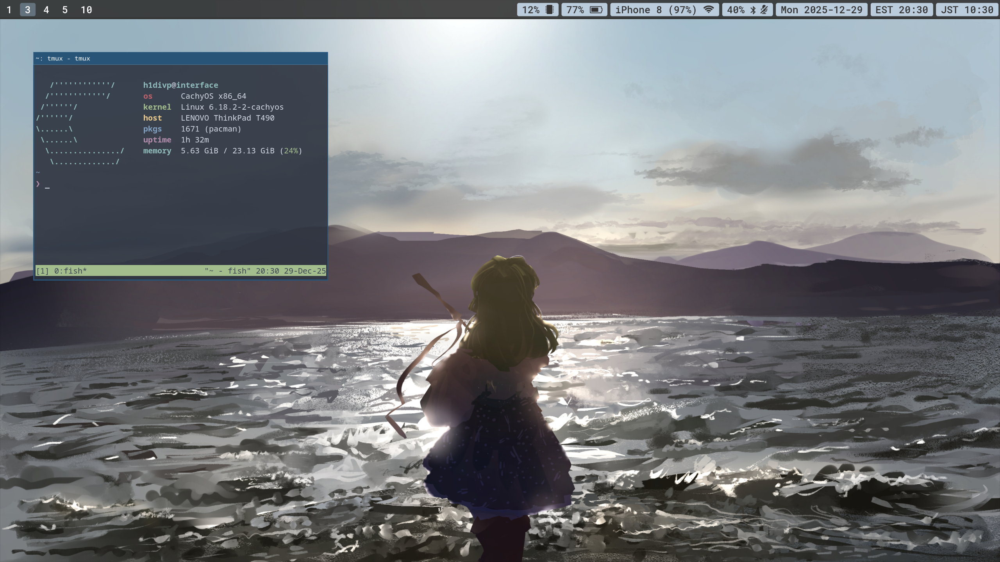

<h2></h2> 

    <b>h1divp's Linux configuration files</b>

<h2></h2> 

    

### Vital programs
* window manager: sway
* bar: waybar
* shell: fish

### Some favorite apps
* top program: [btop](https://github.com/aristocratos/btop)
* file browser: [yazi](https://yazi-rs.github.io/)
* web browser: librewolf
    * An underrated thing about firefox is that you can setup different profiles for work/leisure/study. I use this feature a lot and it helps accidental account sign-ins.
* text editor: [helix](https://github.com/helix-editor/helix) (I used to use neovim a lot, but I switched since I don't have to worry about configuration as much)
* other utilities I couldn't live without
    * [Clonezilla](https://clonezilla.org/) (for backups, copying drives)
    * for system ressurection: [gparted live USB](https://gparted.org/liveusb.php), [arch live USB](https://archlinux.org/download/) (on flash drives)
    * redshift (xorg) and wlsunset (wayland)
    * rclone
