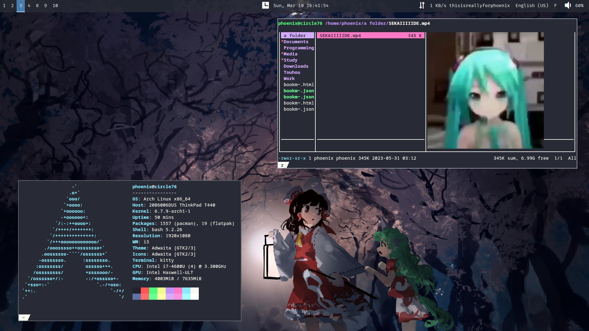

<h2></h2> 

    <b>h1divp's Linux configuration files</b>

<h2></h2> 

    

### hi there

I've been using arch linux for the past few years. I used to spend a lot of time configuring, but I feel like I'm now at a point where I don't worry about it much anymore, and pretty much
everything I need is set up.

If you see something you like, feel free to use it in your own config.
